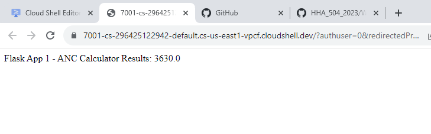
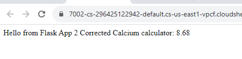

# docker_flask_homework

# Docker-Flask Part 1

Setup: Flask app, dockerfile, app.py, requirements.txt

1. Ensure flask app deploys locally
2. In the CLI navigate to the immediate folder containing the flask app
3. Enter "docker build -t part1app . " to build the image. -t tags the image with a name
4. Enter "docker run -d -p 5001:5000 part1app " to run the image. -p maps the port of the container to the port of the host machine. The first port is for the host machine and the second port is for the container.
5. Deploy app by previewing port and changing the port to 5001
6. Enter "docker images" to display the docker instances that have been created
7. Enter "docker stop [container id]" to stop the image from running
8. Enter "docker prune -a -f" to completely delete the docker instance

# Docker-Flask Part 2

Setup: A docker-compose.yaml file and 2 flask folders, each containing app.py, dockerfile, requirements.txt

1. Deploy each flask app locally
2. In the CLI, enter "docker-compose up --build"
3. Authorize google cloud shell to make the changes
4. Preview and change the ports to 7001 and 7002 respectively to view each app
5. To delete, enter "docker compose rm" then type in yes

Discuss the role of Docker Compose and how it differs from using Docker alone.

1. Docker Compose runs at the same level as the part 2 folder compared to docker alone, which runs within the folder containing the app.

# Reflections

Observations:

1. Docker Compose enables multiple containers to run on Docker. Each container still requires a Docker file, but with Docker Compose, you can control how the multiple containers run individually and interact with each other.

Challenges: 

1. The Part1 docker app did not deploy until I changed the python version from 3.7 to 3.10. Then the app ran seamlessly.
